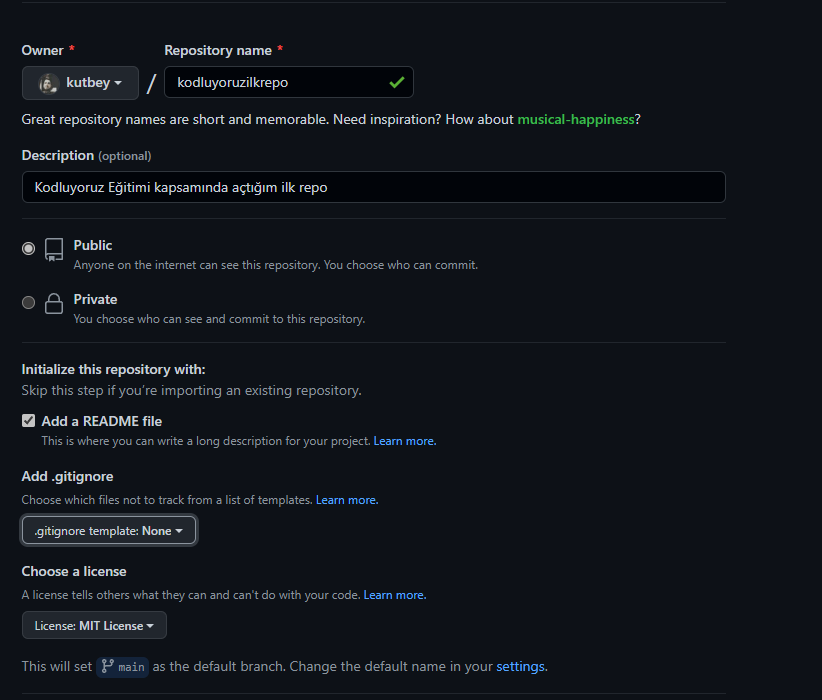

# Kodluyoruz İlk Repo

Bu repo [Kodluyoruz](https://www.kodluyoruz.org/) Front-End Eğitiminde oluşturuduğumuz ilk repo. İçerisinde bir adet README dosyası,bir adet index.html barındırıyor.



## Installatıon

Öncelikle projeyi klonlayın.(Buraya sizin reponuzdan aldığınız link gelecek.)

```

git clone https://github.com/kutbey/kodluyoruzilkrepo.git

```

## Usage

Projeyi klonladıktan sonra Visual Studio Code programında açınız.

Git Bash Terminali Üzerinden:

```
cd kodluyoruz

code .
```

## Contributing 

Pull Request'ler kabul edilir. Majör değişiklikler için; öncelikle neyi değiştirmek istediğinizi belirtmek için Issues(Sorunlar) kısmında tartışma açınız.


## License
[MIT](https://choosealicense.com/licenses/mit/)
